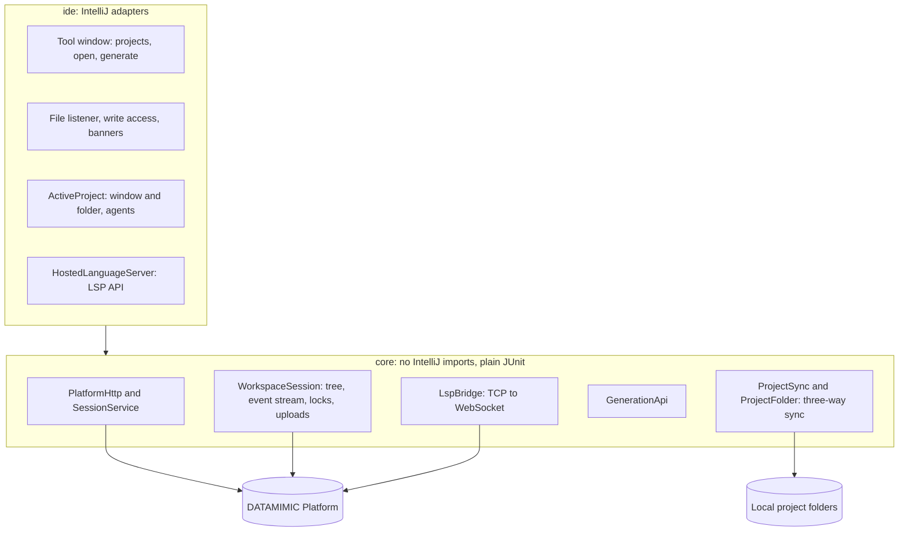

# DATAMIMIC for JetBrains IDEs

Work on DATAMIMIC Platform projects in your IDE: synced project folders, edit locks, the platform's language server,
data generation, and MCP access for IDE agents.

> Status: early development, IntelliJ Platform 2025.3+.

## Features

**Platform projects** (DATAMIMIC tool window, left side)

- Sign in with your platform account; the session lasts 30 days ([ADR 0001](docs/adr/0001-platform-session-auth.md)).
- *Open Project* downloads a project to `~/DATAMIMIC/<platform>/<name>-<id>` and opens it as a normal project in a new
  window: Project view, search and agents work on real files ([ADR 0003](docs/adr/0003-local-project-folder.md)).
- The folder stays in sync: saves and changes made by agents upload; changes on the platform download, never over
  unsaved edits. Create, rename, move and delete in the Project view reach the platform. The platform stays the
  source of truth; a file changed on both sides shows a conflict banner (*Keep mine* / *Use the platform version*).
- Files deleted outside the IDE are never deleted on the platform without asking: a notification offers *Restore*
  or *Delete on platform…*.
- Each window is one platform project, like in the platform UI; it scopes files, locks and IDE agents
  ([ADR 0002](docs/adr/0002-active-project-scope.md)).
- IDE agents are connected to the window's project MCP server automatically: Claude Code (local scope) and Junie
  (the folder's `.junie/mcp/mcp.json`). AI Assistant: *Copy MCP Configuration for AI Assistant*.
- Server-side edit locks: showing a file takes its lock, a banner explains when someone else holds it, and
  *Take over…* overrides it after confirmation.
- Completion and checks for the folder's XML files from the platform's language server
  ([ADR 0004](docs/adr/0004-hosted-language-server.md)). The status bar shows *DATAMIMIC LSP: connected / ready / off /
  error*; click it to turn the server on or off for the project, or to check again. Needs an IDE with the LSP API.
- *Generate Data…* on the window's project: runs on the platform and shows the log and a preview per product.

Local DATAMIMIC CE support is not part of this version; it follows once CE authoring is reworked.

## Architecture

`core` never imports `com.intellij`; a test enforces it.

## Development

| Task | Command |
|---|---|
| Unit and plugin tests | `./gradlew test` |
| Run an IDE with the plugin | `./gradlew runIde` (debug via the run configuration in `.run/`) |
| Package | `./gradlew buildPlugin` |

Manual test against a local platform: start it with `DM_PLATFORM_PUBLIC_URL=http://localhost:3000`, then in the sandbox
IDE open the DATAMIMIC tool window and sign in with `http://localhost:3000` (exactly the public URL).

Diagnostics: the plugin logs to the IDE log (*Help → Show Log*; in the sandbox
`.intellijPlatform/sandbox/*/log_runIde/idea.log`) under `#c.r.d.i.l.HostedLanguageServer` (language server) and
`#c.r.d.i.DatamimicPlatform` (live updates).
