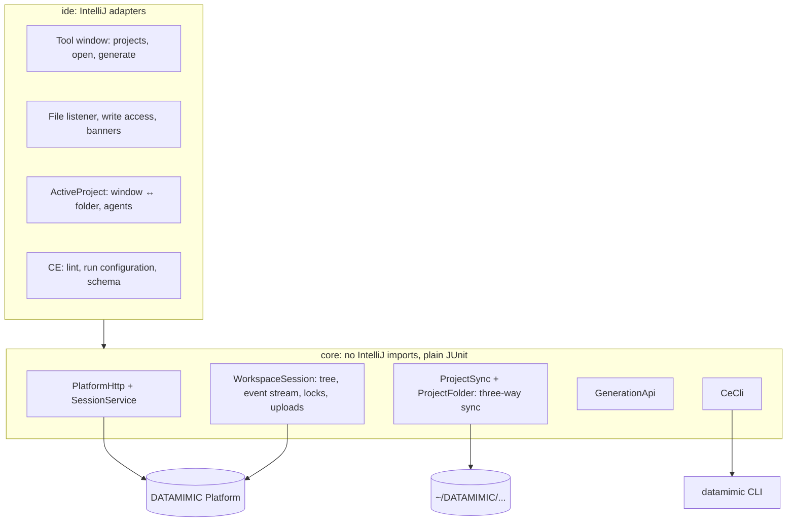

# DATAMIMIC for JetBrains IDEs

Author and run deterministic DATAMIMIC test data models in your IDE: edit projects on a DATAMIMIC Platform, or work
on local descriptors with DATAMIMIC CE.

> Status: early development, IntelliJ Platform 2025.3+.

## Features

**Platform projects** (DATAMIMIC tool window, left side)

- Sign in with your platform account; the session lasts 30 days ([ADR 0001](docs/adr/0001-platform-session-auth.md)).
- *Open Project* downloads a project to `~/DATAMIMIC/<platform>/<name>-<id>` and opens it as a normal project in a new
  window: Project view, search and agents work on real files ([ADR 0003](docs/adr/0003-local-project-folder.md)).
- The folder stays in sync: saves and changes made by agents upload; changes on the platform download, never over
  unsaved edits. Create, rename, move and delete in the Project view reach the platform. The platform stays the
  source of truth; a file changed on both sides shows a conflict banner (*Keep mine* / *Use the platform version*).
- Files deleted outside the IDE are never deleted on the platform without asking: a notification offers *Restore*
  or *Delete on platform…*.
- Each window is one platform project, like in the platform UI; it scopes files, locks and IDE agents
  ([ADR 0002](docs/adr/0002-active-project-scope.md)).
- IDE agents are connected to the window's project MCP server automatically: Claude Code (local scope) and Junie
  (the folder's `.junie/mcp/mcp.json`). AI Assistant: *Copy MCP Configuration for AI Assistant*.
- Server-side edit locks: showing a file takes its lock, a banner explains when someone else holds it, and
  *Take over…* overrides it after confirmation.
- *Generate Data…* on the window's project: runs on the platform and shows the log and a preview per product.

**Local descriptors** (any XML file whose root is `<setup>`, outside platform project folders)

- Lint findings from `datamimic lint` in the editor, refreshed after each save.
- Run configuration *DATAMIMIC*: right-click a descriptor → Run. Each run writes to `output/ide-<timestamp>/`.
- JSON Schema completion and validation for `*.dm.json` authoring models.
- *Tools → Copy DATAMIMIC CE MCP Configuration*: an MCP server entry for IDE agents (stdio, no credentials).
- DATAMIMIC CE is found in *Settings → Tools → DATAMIMIC*, else in the project's `.venv`, else on `PATH`.
  Install it with `pip install "datamimic-ce[mcp]"`.

Not built yet: hosted language server (completion/diagnostics for platform files), CE completion.

## Architecture

`core` never imports `com.intellij`; a test enforces it.

## Development

| Task | Command |
|---|---|
| Unit and plugin tests | `./gradlew test` |
| Run an IDE with the plugin | `./gradlew runIde` (debug via the run configuration in `.run/`) |
| Package | `./gradlew buildPlugin` |

Manual test against a local platform: start it with `DM_PLATFORM_PUBLIC_URL=http://localhost:3000`, then in the sandbox
IDE open the DATAMIMIC tool window and sign in with `http://localhost:3000` (exactly the public URL).

Local CE: `python3 -m venv .venv && .venv/bin/pip install "datamimic-ce[mcp]"`, then
`.venv/bin/datamimic demo create --all --target demos` and open a descriptor.
