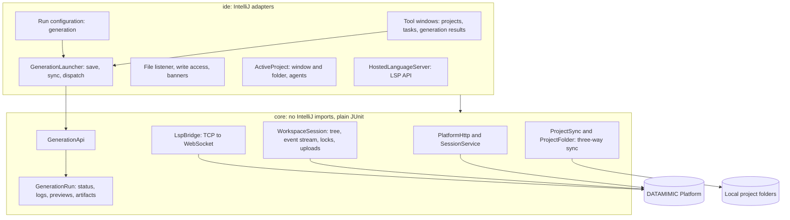

# DATAMIMIC for JetBrains IDEs

Work on DATAMIMIC Platform projects in your IDE: synced project folders, edit locks, the platform's language server,
generation runs, and MCP access for IDE agents.

> **Requires a DATAMIMIC Enterprise Platform** and an account on it; the plugin does not work without one. Standalone
> DATAMIMIC CE projects are not supported.
>
> Status: early development. Requires a JetBrains IDE 2024.2+; the optional language-server integration requires
> 2025.2.1+.

## Features

**Platform projects** (DATAMIMIC tool window, left side)

- Sign in with your platform account; the session lasts 30 days ([ADR 0001](docs/adr/0001-platform-session-auth.md)).
- *Open Project* downloads a project to `~/DATAMIMIC/<platform>/<name>-<id>` and opens it as a normal project in a new
  window: Project view, search and agents work on real files ([ADR 0003](docs/adr/0003-local-project-folder.md)).
- The folder stays in sync: saves and changes made by agents upload; changes on the platform download, never over
  unsaved edits. Create, rename, move and delete in the Project view reach the platform. The platform stays the
  source of truth; a file changed on both sides shows a conflict banner (*Keep mine* / *Use the platform version*).
- Files deleted outside the IDE are never deleted on the platform without asking: a notification offers *Restore*
  or *Delete on platform…*.
- Each window is one platform project, like in the platform UI; it scopes files, locks and IDE agents
  ([ADR 0002](docs/adr/0002-active-project-scope.md)).
- IDE agents are connected to the window's project MCP server automatically: Claude Code (local scope) and Junie
  (the folder's `.junie/mcp/mcp.json` and a project-local routing rule). AI Assistant: *Copy MCP Configuration for AI Assistant*.
- Server-side edit locks: showing a file takes its lock, a banner explains when someone else holds it, and
  *Take over…* overrides it after confirmation.
- Completion and checks for the folder's XML files from the platform's language server
  ([ADR 0004](docs/adr/0004-hosted-language-server.md)). The status bar shows *DATAMIMIC LSP: connected / ready / off /
  error*; click it to turn the server on or off for the project, or to check again. Requires JetBrains 2025.2.1+.
- Generate from the project window or a native **DATAMIMIC Generation** Run Configuration. The configuration is local,
  keeps only the platform/project identity and task type, and validates that the opened folder is connected before it
  runs. Each run shows platform status, logs, refresh errors, and preview samples when available; **Stop** requests
  platform cancellation, while closing a view only stops local observation.
- The bottom **Generation Tasks** tool window lists recent platform generation tasks. Select a task to reopen its logs and
  preview samples. Successful tasks also expose **Artifacts**: save one file, open saved text files in the IDE, or
  download every artifact as a ZIP.

## Junie routing

The plugin adds `.junie/rules/datamimic.md` for a connected DATAMIMIC project. It routes DATAMIMIC Platform project
requests to a read-only `datamimic_*` MCP tool first and forbids a fallback to local project content when those tools
are unavailable. The detailed workflow stays in Platform `MCP_SERVER_INSTRUCTIONS`.

Junie must use its default Guidelines path. A custom Guidelines path bypasses project rules and cannot be detected
through a stable public JetBrains API; clear that setting or include the same routing manually. An existing
`.junie/AGENTS.md` is exclusive guidance, so the plugin connects MCP, warns about the conflict, and leaves the file
unchanged. The credential-free routing rule remains when the project disconnects; only the token-bearing MCP entry
is removed.

## Architecture

```mermaid
flowchart TB
  subgraph ide["ide: IntelliJ adapters"]
    TW["Tool windows: projects, tasks, generation results"]
    RC["Run configuration: generation"]
    GL["GenerationLauncher: save, sync, dispatch"]
    FL["File listener, write access, banners"]
    AP["ActiveProject: window and folder, agents"]
    LSP["HostedLanguageServer: LSP API"]
  end
  subgraph core["core: no IntelliJ imports, plain JUnit"]
    HTTP["PlatformHttp and SessionService"]
    WS["WorkspaceSession: tree, event stream, locks, uploads"]
    SY["ProjectSync and ProjectFolder: three-way sync"]
    GEN[GenerationApi]
    GR["GenerationRun: status, logs, previews, artifacts"]
    BR["LspBridge: TCP to WebSocket"]
  end
  TW --> GL
  RC --> GL
  ide --> core
  GL --> GEN
  GEN --> GR
  HTTP --> P[("DATAMIMIC Platform")]
  WS --> P
  SY --> D[("Local project folders")]
  BR --> P
```

`core` never imports `com.intellij`; a test enforces it.

## Development

| Task | Command |
|---|---|
| Unit and plugin tests | `./gradlew test` |
| Run an IDE with the plugin | `./gradlew runIde` |
| Package | `./gradlew buildPlugin` |

CI (`.github/workflows/build.yml`) tests and builds pull requests, pushes to `main`, and version tags; the ZIP is
attached to the run. Non-tag builds use `<highest-reachable-semver-tag>-dev.<github-run-number>` and are development
artifacts, not releases; local builds default to `0.0.0-dev`. Releasing: add `## [<version>]` to `CHANGELOG.md`, then
push `v<version>`. A tag build uses the exact tag version, runs the Plugin Verifier, and publishes a GitHub release
with the ZIP and that CHANGELOG section.

Manual test against a local platform: start it with `DM_PLATFORM_PUBLIC_URL=http://localhost:3000`, then in the sandbox
IDE open the DATAMIMIC tool window and sign in with `http://localhost:3000` (exactly the public URL).

Diagnostics: the plugin logs to the IDE log (*Help → Show Log*; in the sandbox
`.intellijPlatform/sandbox/*/log_runIde/idea.log`) under `#c.r.d.i.l.HostedLanguageServer` (language server) and
`#c.r.d.i.DatamimicPlatform` (live updates).
