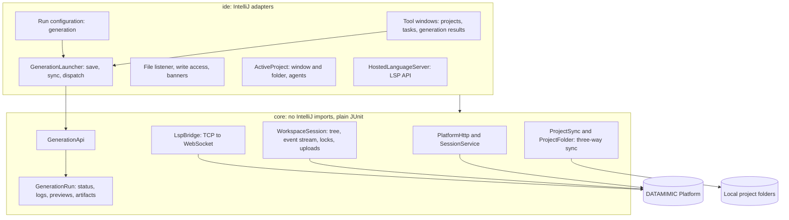

# DATAMIMIC for JetBrains IDEs

Work on DATAMIMIC Platform projects in your IDE: synced project folders, edit locks, the platform's language server,
generation runs, and MCP access for IDE agents.

> **Requires a DATAMIMIC Enterprise Platform** and an account on it; the plugin does not work without one. Standalone
> DATAMIMIC CE projects are not supported.
>
> Status: early development. Requires a JetBrains IDE 2024.2+; the optional language-server integration requires
> 2025.2.1+.

## Features

**Platform projects** (DATAMIMIC tool window, left side)

- Sign in with your platform account; the session lasts 30 days ([ADR 0001](docs/adr/0001-platform-session-auth.md)).
- *Open Project* downloads a project to `~/DATAMIMIC/<platform>/<name>-<id>` and opens it as a normal project in a new
  window: Project view, search and agents work on real files ([ADR 0003](docs/adr/0003-local-project-folder.md)).
- The folder stays in sync: saves and changes made by agents upload; changes on the platform download, never over
  unsaved edits. Create, rename, move and delete in the Project view reach the platform. The platform stays the
  source of truth; a file changed on both sides shows a conflict banner (*Keep mine* / *Use the platform version*).
- Files deleted outside the IDE are never deleted on the platform without asking: a notification offers *Restore*
  or *Delete on platform…*.
- Each window is one platform project, like in the platform UI; it scopes files, locks and IDE agents
  ([ADR 0002](docs/adr/0002-active-project-scope.md)).
- IDE agents are connected to the project's MCP server automatically: Claude Code (local scope) and Junie
  (`.junie/mcp/mcp.json` plus a project-local routing rule). The plugin creates and renews a short-lived project access
  token from the existing platform session. AI Assistant is off by default; enable **Settings | Tools | DATAMIMIC** to
  publish its project-scoped `.ai/mcp/mcp.json` entry.
- Server-side edit locks: showing a file takes its lock, a banner explains when someone else holds it, and
  *Take over…* overrides it after confirmation.
- Completion and checks for the folder's XML files from the platform's language server
  ([ADR 0004](docs/adr/0004-hosted-language-server.md)). The status bar shows *DATAMIMIC LSP: connected / ready / off /
  error*; click it to turn the server on or off for the project, or to check again. Requires JetBrains 2025.2.1+.
- Generate from the project window or a native **DATAMIMIC Generation** Run Configuration. The configuration is local,
  keeps only the platform/project identity and task type, and validates that the opened folder is connected before it
  runs. Each run shows platform status, logs, refresh errors, and preview samples when available; **Stop** requests
  platform cancellation, while closing a view only stops local observation.
- The bottom **Generation Tasks** tool window lists recent platform generation tasks. Select a task to reopen its logs and
  preview samples. Successful tasks also expose **Artifacts**: save one file, open saved text files in the IDE, or
  download every artifact as a ZIP.

## Junie routing

Without existing Junie guidance, the plugin adds `.junie/AGENTS.md` for a connected DATAMIMIC project. It combines
Junie-specific routing with a synchronized projection of Platform `MCP_SERVER_INSTRUCTIONS`: use canonical DM JSON,
build exactly one candidate, run the bounded authoring dry run through `datamimic_build_model`, repair rejected work
from its diagnostics, and commit only a Ready execution. It also forbids local project fallback, delegation, and
agent-started generation; generation remains an explicit user action through the IDE's **DATAMIMIC Generation** Run
Configuration or the Platform UI.

The plugin never replaces user-owned `.junie/AGENTS.md`, root `AGENTS.md`, `.junie/playbook.md`, or user rules. With
combined guidance it uses `.junie/rules/datamimic.md` and warns when older Junie may need the routing included manually.
Exclusive or legacy `.junie/guidelines.md` / `.junie/guidelines/` guidance remains untouched and requires manual
inclusion. The token-bearing MCP entry is local, Git-ignored, and removed before its project token is revoked.

## AI Assistant MCP

Enable **Publish DATAMIMIC MCP configuration for AI Assistant** in **Settings | Tools | DATAMIMIC** for a connected
project. The plugin owns only its `datamimic-platform` entry in `.ai/mcp/mcp.json`, renews it with the project token,
and removes that exact entry when disabled or disconnected. AI Assistant still needs **Automatically enable new and
changed MCP servers** and **Pass custom MCP servers**; this file alone does not prove the MCP is active in a chat.

## Architecture

```mermaid
flowchart TB
  subgraph ide["ide: IntelliJ adapters"]
    TW["Tool windows: projects, tasks, generation results"]
    RC["Run configuration: generation"]
    GL["GenerationLauncher: save, sync, dispatch"]
    FL["File listener, write access, banners"]
    AP["ActiveProject: window and folder, agents"]
    LSP["HostedLanguageServer: LSP API"]
  end
  subgraph core["core: no IntelliJ imports, plain JUnit"]
    HTTP["PlatformHttp and SessionService"]
    WS["WorkspaceSession: tree, event stream, locks, uploads"]
    SY["ProjectSync and ProjectFolder: three-way sync"]
    GEN[GenerationApi]
    GR["GenerationRun: status, logs, previews, artifacts"]
    BR["LspBridge: TCP to WebSocket"]
  end
  TW --> GL
  RC --> GL
  ide --> core
  GL --> GEN
  GEN --> GR
  HTTP --> P[("DATAMIMIC Platform")]
  WS --> P
  SY --> D[("Local project folders")]
  BR --> P
```

`core` never imports `com.intellij`; a test enforces it.

## Development

| Task | Command |
|---|---|
| Unit and plugin tests | `./gradlew test` |
| Run an IDE with the plugin | `./gradlew runIde` |
| Package | `./gradlew buildPlugin` |
| Check Junie guidance against Platform | `./scripts/sync-agent-guidance.sh --check <platform-checkout>` |

CI (`.github/workflows/build.yml`) tests and builds pull requests, pushes to `main`, and version tags. The downloaded
`datamimic-plugin.zip` artifact is directly installable with **Install Plugin from Disk**. Non-tag builds use
`<highest-reachable-semver-tag>-dev.<github-run-number>` and are development artifacts, not releases; local builds
default to `0.0.0-dev`. Do not upload either to JetBrains Marketplace. Releasing: add `## [<version>]` to
`CHANGELOG.md`, then push `v<version>`. A tag build uses the exact tag version, renders that complete CHANGELOG section
as the plugin's **What's New** notes, verifies non-empty packaged notes with the expected number of list items, runs
the Plugin Verifier, and publishes a GitHub release with the original versioned distribution ZIP. Marketplace keeps
each uploaded version's notes in its version history; its main **What's New** view shows the latest version.

Manual test against a local platform: start it with `DM_PLATFORM_PUBLIC_URL=http://localhost:3000`, then in the sandbox
IDE open the DATAMIMIC tool window and sign in with `http://localhost:3000` (exactly the public URL).

Diagnostics: the plugin logs to the IDE log (*Help → Show Log*; in the sandbox
`.intellijPlatform/sandbox/*/log_runIde/idea.log`) under `#c.r.d.i.l.HostedLanguageServer` (language server) and
`#c.r.d.i.DatamimicPlatform` (live updates).
