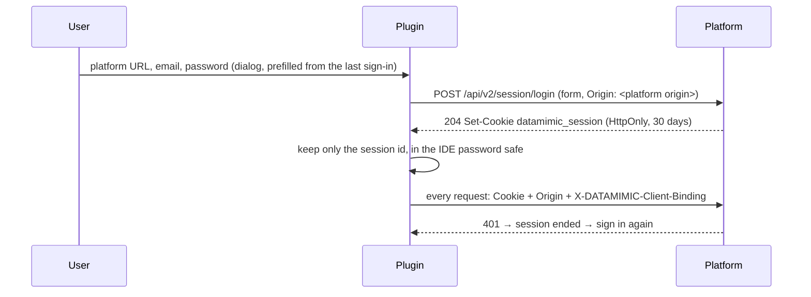

# 0001 — Sign in with the platform session, not OAuth

- Status: Accepted
- Date: 2026-09-23

## Context

The VS Code extension signs in with OAuth (Authorization Code + PKCE). The platform hands the result back through
its HTTPS relay `/api/v2/oauth/native-callback/…`, which only accepts the `vscode`, `kiro` and `antigravity-ide`
URI schemes (`oauth_routers.py:49`).

A JetBrains IDE has no such scheme, and the standard native-app alternative, an RFC 8252 loopback redirect to
`http://127.0.0.1:<port>`, does not work either. The consent page sends `Content-Security-Policy: form-action 'self'`
and answers "Allow" with a 302 to the redirect URI. Chromium blocks that cross-origin redirect after the form post
("violates … form-action 'self'"), which was reproduced with the same header and response.

The platform must not be changed for the plugin.

## Decision

The plugin signs in like the web UI:

- The dialog remembers the last platform URL and email. The password is stored only when the user ticks
  *Remember password*, and then only in the operating system's credential store (IDE password safe).
- The session lives `DM_BROWSER_SESSION_EXPIRE_SECONDS` (30 days by default). There is no refresh; a 401 means
  signing in again.
- Every request carries `Origin: <platform public origin>`, because the platform accepts cookie sessions on unsafe
  requests and on its WebSockets only with exactly that origin.
- The credential key includes the IDE product code, so two installed IDEs keep separate sessions.
- One client binding per IDE process: all project windows share one platform client.

## Consequences

- The platform URL must be its public origin (`DM_PLATFORM_PUBLIC_URL`) without a path; `localhost` and `127.0.0.1`
  are different origins.
- The plugin depends on the browser-session contract (cookie name, Origin rule). If the platform adds CSRF tokens,
  this breaks and must be revisited.
- MCP needs bearer tokens and does not accept the session. Agents get the platform MCP through their own OAuth or a
  project access token (not built yet).
- OAuth can replace this without changing the rest of the client if the platform ever relays loopback callbacks.

## Verification

- `SessionTest`: login stores only the session id, sends Origin, handles 401 and logout revocation.
- `WorkspaceEventStreamTest`: the WebSocket handshake carries the cookie and Origin.
