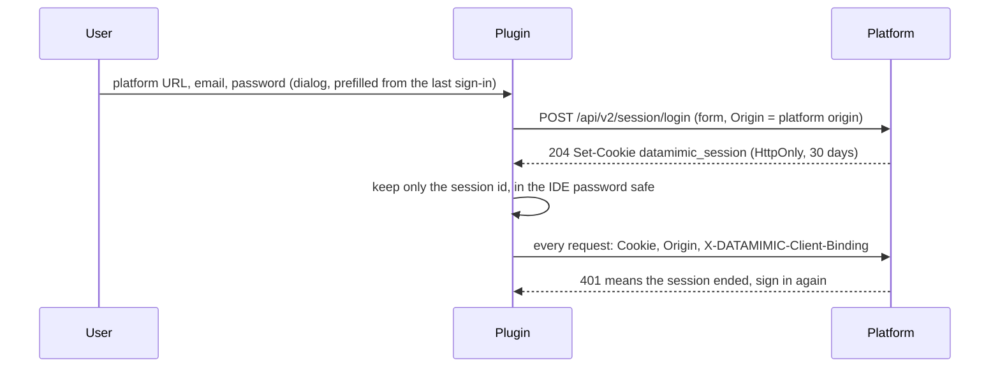

# 0001 — Sign in with the platform session, not OAuth

- Status: Accepted
- Date: 2026-09-23

## Context

The VS Code extension signs in with OAuth. The JetBrains plugin already owns a direct Platform UI and does not need a
browser round trip for its own session. Current Junie ACP does not surface a remote-MCP OAuth authorization action to
the plugin, so Junie temporarily uses the same short-lived project access token as the other header-based agents.

## Decision

The plugin signs in like the web UI:

```mermaid
sequenceDiagram
  participant U as User
  participant P as Plugin
  participant S as Platform
  U->>P: platform URL, email, password (dialog, prefilled from the last sign-in)
  P->>S: POST /api/v2/session/login (form, Origin = platform origin)
  S-->>P: 204 Set-Cookie datamimic_session (HttpOnly, 30 days)
  P->>P: keep only the session id, in the IDE password safe
  P->>S: every request: Cookie, Origin, X-DATAMIMIC-Client-Binding
  S-->>P: 401 means the session ended, sign in again
```

- The dialog remembers the last platform URL and email. The password is stored only when the user ticks
  *Remember password*, and then only in the operating system's credential store (IDE password safe).
- The session lives `DM_BROWSER_SESSION_EXPIRE_SECONDS` (30 days by default). There is no refresh; a 401 means
  signing in again.
- Every request carries `Origin: <platform public origin>`, because the platform accepts cookie sessions on unsafe
  requests and on its WebSockets only with exactly that origin.
- The credential key includes the IDE product code, so two installed IDEs keep separate sessions.
- One client binding per IDE process: all project windows share one platform client.

## Consequences

- The platform URL must be its public origin (`DM_PLATFORM_PUBLIC_URL`) without a path; `localhost` and `127.0.0.1`
  are different origins.
- The plugin depends on the browser-session contract (cookie name, Origin rule). If the platform adds CSRF tokens,
  this breaks and must be revisited.
- MCP needs bearer tokens and does not accept the session. Claude Code and the manual AI Assistant configuration get
  a short-lived project access token; they never receive the browser session.
- Junie's project configuration temporarily contains the same short-lived project access token as other header-based
  agents. It is local-only, owner-readable where supported, and removed before revocation. Replace this path with
  standard MCP OAuth when Junie exposes the authorization action through a stable public API.

## Verification

- `SessionTest`: login stores only the session id, sends Origin, handles 401 and logout revocation.
- `WorkspaceEventStreamTest`: the WebSocket handshake carries the cookie and Origin.
