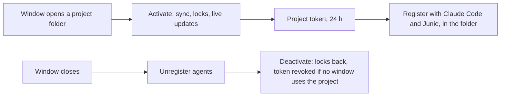

# 0002 — One active platform project per IDE window

- Status: Accepted
- Date: 2026-09-23

## Context

The platform UI works on one open project at a time, and that project is the scope of its MCP server and hosted LSP.
A JetBrains window could show every project of the account side by side, which leaves no answer to "which project do
the IDE agents in this window work on?".

## Decision

Each IDE window has at most one platform project (`ActiveProject`): the one its folder is a copy of
([ADR 0003](0003-local-project-folder.md)). The folder's `.datamimic/workspace.json` names it, so it survives
restarts and needs no other setting. *Open Project* on another project opens that project's folder in its own
window; a window never switches projects.

- Files, locks, live updates, generation and agents of a window belong to its project. A window whose folder belongs
  to another platform than the one signed in stays unconnected and says so.
- IDE agents reach the platform MCP server with a project access token: the MCP endpoint does not accept the session
  cookie ([ADR 0001](0001-platform-session-auth.md)). One token per IDE product and project, shared by all windows,
  renewed four hours before it expires, revoked when the last window leaves the project.
- Agents get their own client binding, never the IDE's, so their file locks are separate from the editor's.
- Registration, per agent:
  - **Claude Code:** `claude mcp add --scope local` in the project directory. The token stays in the user's Claude
    configuration, not in the repository.
  - **Junie:** the project's `.junie/mcp/mcp.json`, only the `datamimic-platform` entry. The file is added to
    `.git/info/exclude`; if Git already tracks it, no token is written.
  - **AI Assistant:** no documented API or file exists, so *Copy MCP Configuration for AI Assistant* hands over the
    entry for *Add → As JSON*. It is not removed automatically.
- Closing the window or signing out removes the registrations. An expired session removes them too; local edits stay
  in the folder and upload after signing in again. Closing a window disconnects synchronously (at most 10 s).
- If the token cannot be created, the agents are disconnected, so they never point at a revoked token.

## Consequences

- Agent sessions that are already running pick up a new or renewed token only after a restart. Renewal replaces the
  shared token (names are unique per project), so running sessions in every window of this IDE lose access about
  four hours before the old token would have expired. Alternating two token names would avoid that.
- While `claude mcp add` runs, the token is visible in the process list to other users of the same machine.
- A crashed IDE leaves registrations behind; their token expires within 24 hours and the next activation overwrites them.
- AI Assistant's entry is never removed automatically and has to be pasted again after a renewal. Junie
  inside AI Assistant sees it only with *Pass custom MCP servers* enabled.
- Unverified: whether Junie's IDE plugin accepts `headers` (its documentation contradicts itself), and whether Claude
  Code applies the local scope when started from a subdirectory of the project.
