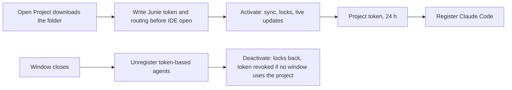

# 0002 — One active platform project per IDE window

- Status: Accepted
- Date: 2026-09-23

## Context

The platform UI works on one open project at a time, and that project is the scope of its MCP server and hosted LSP.
A JetBrains window could show every project of the account side by side, which leaves no answer to "which project do
the IDE agents in this window work on?".

## Decision

Each IDE window has at most one platform project (`ActiveProject`): the one its folder is a copy of
([ADR 0003](0003-local-project-folder.md)). The folder's `.datamimic/workspace.json` names it, so it survives
restarts and needs no other setting. *Open Project* on another project opens that project's folder in its own
window; a window never switches projects.

```mermaid
flowchart LR
  O["Open Project downloads the folder"] --> J["Write Junie token and routing before IDE open"]
  J --> A["Activate: sync, locks, live updates"]
  A --> T["Project token, 24 h"]
  T --> C["Register Claude Code"]
  X["Window closes"] --> U["Unregister token-based agents"]
  U --> D["Deactivate: locks back, token revoked if no window uses the project"]
```

- Files, locks, live updates, generation (including its local Run Configurations) and agents of a window belong to its
  project. A window whose folder belongs to another platform than the one signed in stays unconnected and says so.
- Header-based IDE agents reach the platform MCP server with a project access token: the MCP endpoint does not accept
  the session cookie ([ADR 0001](0001-platform-session-auth.md)). One token per IDE process and project is shared by
  its windows. A replacement is created and published four hours before expiry; the prior token is left to expire so
  another open window is never cut off. Plugin-owned tokens are revoked when the last window leaves the project.
- Agents get their own client binding, never the IDE's, so their file locks are separate from the editor's.
- Registration, per agent:
  - **Claude Code:** `claude mcp add --scope local` in the project directory. The token stays in the user's Claude
    configuration, not in the repository.
  - **Junie:** before the first IDE open, write the project URL and token headers as the `datamimic-platform` entry
    in `.junie/mcp/mcp.json`, plus `.junie/rules/datamimic.md`. Both files stay out of Git; the configuration is
    owner-readable where supported, and tracked configuration and existing guidance are left unchanged.
  - **AI Assistant:** no documented API or file exists, so *Copy MCP Configuration for AI Assistant* hands over the
    entry for *Add → As JSON*. It is not removed automatically.
- Closing the window or signing out removes token-based registrations, including Junie's managed token entry, before
  revocation. The routing rule remains local. An expired plugin session removes token-based registrations; local edits
  stay in the folder and upload after signing in again. Closing a window disconnects synchronously (at most 10 s).
- If a replacement token cannot be created, agents retain the current valid token and the plugin reports the failure.

## Consequences

- Agent sessions that are already running pick up a new or renewed token only after a restart. The previous token has
  less than four hours left when the replacement is published, so ongoing sessions are not cut off by renewal.
- While `claude mcp add` runs, the token is visible in the process list to other users of the same machine.
- A crashed IDE leaves registrations behind; their token expires within 24 hours and the next activation overwrites them.
- AI Assistant's entry is never removed automatically and has to be pasted again after a renewal. Junie's current ACP
  integration does not surface a stable public hook for remote-MCP OAuth authorization, so it uses the same temporary
  project-token lifecycle as Claude Code.
- Unverified: whether Claude Code applies the local scope when started from a subdirectory of the project.
