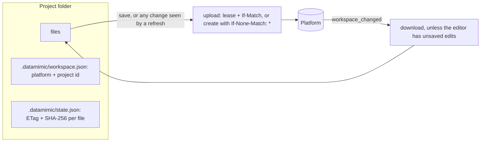

# 0003 — Platform projects open as synced local folders

- Status: Accepted
- Date: 2026-09-23

## Context

The first version showed platform files in the DATAMIMIC tool window through a virtual file system
(`datamimic://`), like the VS Code extension, which adds a virtual workspace root to its explorer. JetBrains has no
virtual roots: a project is a local directory. Platform files therefore never appeared in the Project view, search,
Find in Files or indexing, and agents such as Claude Code or Junie, which work on real files, could not see them.

The platform must stay the source of truth and must not be changed ([ADR 0001](0001-platform-session-auth.md)).

## Decision

*Open Project* downloads the project into `~/DATAMIMIC/<platform host>/<name>-<id>` and opens that folder as a normal
project in a new window. The plugin keeps the folder and the platform in step.

This reverses the VS Code extension's "no local copy" rule for JetBrains IDEs only.

- **Identity.** `.datamimic/workspace.json` names the platform and project; the folder name is only for people. A
  window whose folder has this file is connected to that project ([ADR 0002](0002-active-project-scope.md)).
- **Base per file.** `.datamimic/state.json` stores the ETag and SHA-256 of the version each file was downloaded or
  uploaded as. It is the only record of "what the platform had", and the ETag every upload is fenced with.
- **Three-way sync** (`reconcile`, one pass at a time):

  | Local vs base | Platform vs base | Result |
  |---|---|---|
  | same | same | nothing |
  | changed | same | upload |
  | same | changed | download, unless the editor has unsaved edits (then a banner offers the platform version) |
  | changed | changed | conflict banner: *Keep mine* or *Use the platform version* |
  | new here | none | create on the platform |
  | new here | new there | equal content is adopted, different content is a conflict |
  | deleted here | any | reported as missing, never deleted on the platform without asking |
  | same | deleted | deleted here |

- **Deletes and moves.** Only deletes, renames and moves made in the IDE reach the platform, with the base ETag and the
  file's lease. A folder is deleted file by file, and only when every platform file in it is the version this folder
  has; anything else in it (never downloaded, changed there, hidden) keeps the folder and restores it here. More than
  five files deleted at once are reported instead. Files that disappear any other way
  (terminal, agents, file manager) produce a notification with *Restore* and *Delete on platform…*. A delete the
  platform refuses restores the file; a refused move is undone locally.
- **Writing.** Editing is refused only while another client is known to hold the file's lock. Offline or while the
  lock state is unknown, editing is allowed: the upload's ETag still fences every change.
- **Never synced:** `.datamimic`, `.idea`, `.git`, `.junie`, `.claude`, `.vscode`, `.DS_Store`, `*.iml`, and the
  IDE's safe-write files (`*.tmp`, `*~`).
- **Generate Data** syncs the folder first (agents write files the IDE may not have noticed) and warns about files
  that are not on the platform, conflicts included.
- **Read-only platform files** (shared from global projects) are written read-only and restored if changed.
- **Safety at the boundary.** Platform paths are checked segment by segment, must stay inside the folder and must
  not pass through a link. Names that differ only in case are skipped and reported.
- **Writes** go to a temporary file in `.datamimic/tmp` and are moved into place, after the base was recorded, so the
  IDE's refresh of a download is recognized as no change.
- **CE features** (lint, run configuration) stay off inside project folders: their files use the platform's
  vocabulary.

## Consequences

- Platform projects look and behave like any local project: Project view, search, indexing, VCS tooling, agents.
- Files exist on disk after the window closes; unconfirmed edits are never lost. They are compared again on the next
  open.
- Two copies can diverge. Conflicts need a decision from the user; there is no merge view yet.
- A pass hashes every file. That is cheap for descriptor projects, but slow for large data files. Caching by size and
  modification time would fix that.
- Empty folders are not downloaded. An empty folder deleted outside the IDE stays on the platform.
- The platform's file templates (*New File* from template) are no longer offered. The Project view's *New* actions
  create plain files.
- A file renamed outside the IDE is seen as a new file plus a missing one. So are deletes and renames made in the IDE
  while signed out: nothing records them until the next sign-in.
- A user file ending in `.tmp` or `~` is never synced.

## Verification

- `ProjectSyncTest`: the reconcile table, first download, path escape via `..` and links, case clashes, echo
  suppression, uploads of external edits, creates, safe-write files, missing files, IDE deletes (file, folder,
  refusal, folder with a file never downloaded, bulk), downloads
  around unsaved edits, conflicts (both resolutions, both-created), moves (success, refusal), read-only files.
- Mutation-checked: removing the unsaved-edit check, the echo check, the tree reload after a change, the bulk
  guard, the link check, the missing-file rule, the restore on refusal, the read-only flag, or the version check of a
  folder delete fails a test.
