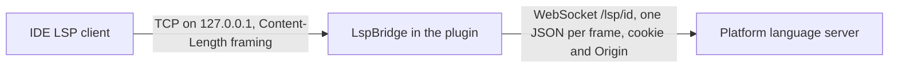

# 0004 — Hosted language server through a local bridge

- Status: Accepted
- Date: 2026-09-24

## Context

The platform runs the DATAMIMIC language server itself (`/lsp/<project-id>`, a WebSocket). It gives completion and
checks for descriptors. The VS Code extension connects its LSP client to that WebSocket directly.

The IntelliJ LSP API can reach a server only through a process's standard streams or a TCP socket
(`LspCommunicationChannel.StdIO` / `Socket`), with `Content-Length` framing. The platform expects one JSON message per
WebSocket frame, the session cookie and exact `Origin` in the handshake, and documents named
`datamimic://project/<id>/<path>`.

## Decision

The plugin keeps using the platform's language server and puts a small bridge between it and the IDE's LSP client.

- **Transport.** `LspBridge` listens on a random loopback port. For each IDE connection it opens the platform
  WebSocket with the shared handshake of all platform WebSockets, and turns stream framing into frames and back. No
  extra process.
- **Frames.** The platform's server writes each message as a binary frame (`send_bytes` in `lsp_session.py`); the
  bridge accepts binary and text frames alike. While connected it pings the platform every 20 seconds, because proxies
  close a WebSocket after about a minute without traffic and an editor is often idle that long.
- **Local authentication.** Any local process can connect to a loopback port, while the upstream connection carries
  the user's session. A client is connected only if its first message is `initialize` with a random secret in its
  initialization options. The descriptor adds the secret; the bridge removes it before forwarding.
- **Start.** When a project folder window opens and the user is signed in to its platform, the plugin reads
  `/lsp/init`. The response goes to the server unchanged as initialization options, and its `root_uri` becomes the
  root. `403 LSP_DISABLED` shows a notice with *Try Again* (for turning it on while the window is open) and starts
  nothing.
- **Documents.** `getFileUri` and `findFileByUri` translate between the synced local files and the canonical
  `datamimic://` URIs: UTF-8 percent-encoding like Python's `quote(safe="-._~")`, upper-case hex. Non-canonical URIs
  are rejected.
- **Refusals.** The platform refuses before accepting, which reaches the client as HTTP 403 on the handshake
  (uvicorn), not as a close code; a close with 1008 can still come mid-session. Both stop the server with a notice
  and *Try Again*, so the IDE does not keep reconnecting on its own. A 401 ends the session as everywhere else.
  Signing out, a closed window and plugin unload stop the server too.
- **Status and switch.** A status bar widget shows the server's state (signed out, starting, off, ready, connected,
  error) with the reason as tooltip. From it, the server can be turned on or off for the project through the platform's
  project API (`PUT /api/v2/projects/<id>` with `config.lsp.enabled`, merged like the platform UI and VS Code do).
  Turning it on waits up to 45 seconds, because each platform process caches "off" for 30 seconds.
- **Visible failures.** Every reason the server does not start or ends shows in the widget, and is written to the IDE
  log (`HostedLanguageServer`, including the bridge's handshake status); nothing is swallowed.
- **Optional.** Everything that touches the LSP API lives in `datamimic-lsp.xml`, loaded only when the IDE has
  `com.intellij.modules.lsp`. Without it the rest of the plugin works unchanged.

## Consequences

- Completion and checks for XML files in platform project folders come from the same server as in VS Code and the
  platform UI.
- The server sees open files as the IDE has them, and all other files as stored on the platform. Local edits that
  are not uploaded yet are invisible to it until uploaded.
- The IDE's own XML support stays active; completion lists can show items from both.
- Unverified until tested against a platform with the language server on: availability of the LSP API in every
  IntelliJ-based IDE (for example PyCharm), and how the IDE treats the server's `datamimic.health` command.

## Verification

- `HostedLspTest`: URI encoding against Python's output, non-canonical and escaping URIs, `lsp/init` (200 and 403),
  handshake path and headers, secret check and removal, framing in both directions with multi-byte text, binary and
  text answers, keepalive pings, policy close, a refused handshake.
- Mutation-checked: removing the secret check or its removal, counting characters instead of bytes, dropping binary
  frames, dropping the policy-close or refused-handshake report, lower-case hex, or accepting non-canonical or dot
  segments fails a test.
